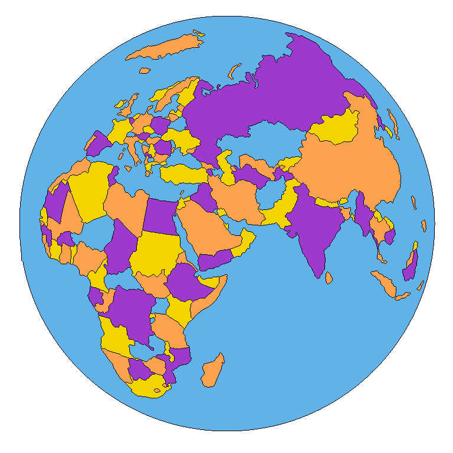

# MapColoring

First a black and white image in a png file is opened. Then three algorithms are available to color the map, either with 6 or with 5 and finally with 4 colors (respectively Euler Algorithm, Kempe Algorithm and Backtracking Algorithm). Note that the last algorithm, using a backtracking approach, is not efficient, in the sense its time complexity is exponential in the number of regions of the map. The two first algorithms are linear.

In order to get nice results, the black lines in your image should be of only 1 pixel wide. See the examples in the repertory Images_NB.

In order to choose which algorithm to apply, according to your operating system, you should press the keys: "ctrl" + "p".

Some libraries are necessary to use directly the software:

- Tkinter
- OpenCV
- Pickle
- time, sys, os.

The three first libraries can be easily installed using "pip install".

With small changes the Pickle library could be avoided if necessary.